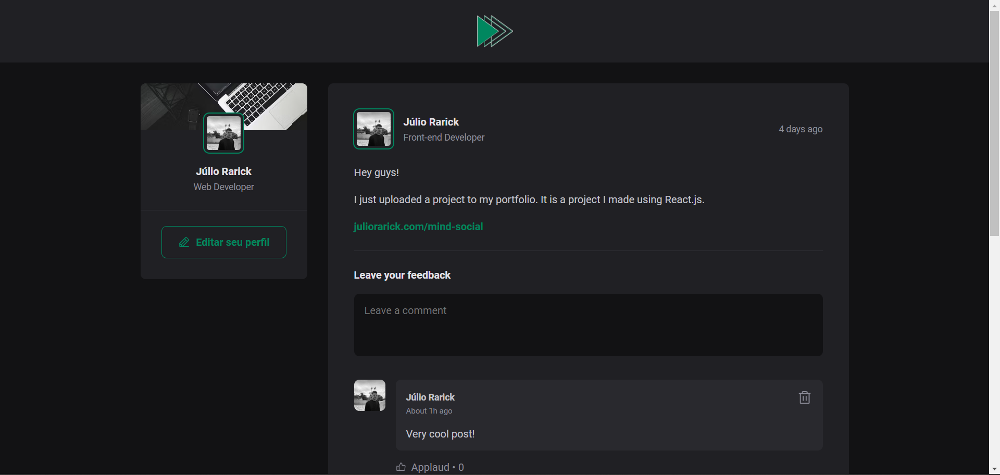

# MindSocial

## Project Description

MindSocial is a web application developed in React.js with the aim of simulating a social network feed. This project was created to enhance my knowledge in React, CSS Modules, and JavaScript.

## Technologies Used

-  React.js: The main library for building the user interface.
-  CSS Modules: Used for modular styling and scoping CSS styles.
-  JavaScript: The primary programming language for adding functionality and interactivity.

## Conclusion

The MindSocial project was a valuable experience to consolidate and expand my skills in web development with React. Creating an application that simulates a social network feed provided an excellent scenario to explore various techniques and best practices in front-end development.
